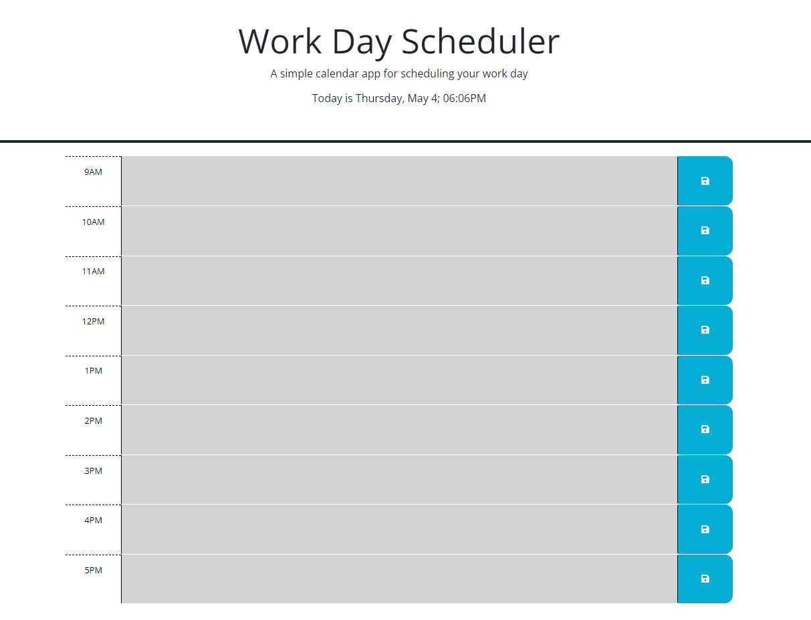

# daily-planner
## Screenshot of the Deployed Page

## URLs
* [Github Repository](https://github.com/SoloSolaire/daily-planner)
* [Deployed Page](https://solosolaire.github.io/daily-planner/)

## Description
This is an application that can be used to better manage your time effectively. This app features the current time and day, as well as color coordinated time blocks. The time blocks will be colored green for a future event, red for present, and grey for a past event. The event/task will also be stored in the local storage when clicking the save button and will continue to display when revisiting the page.